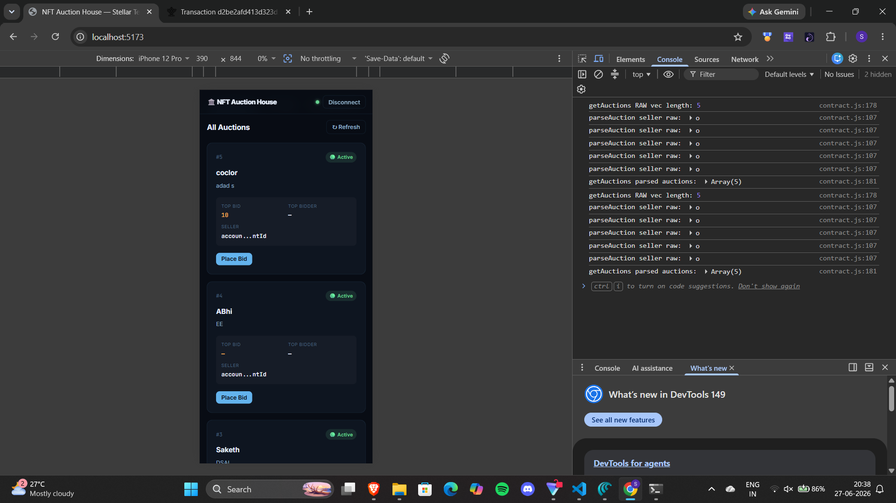
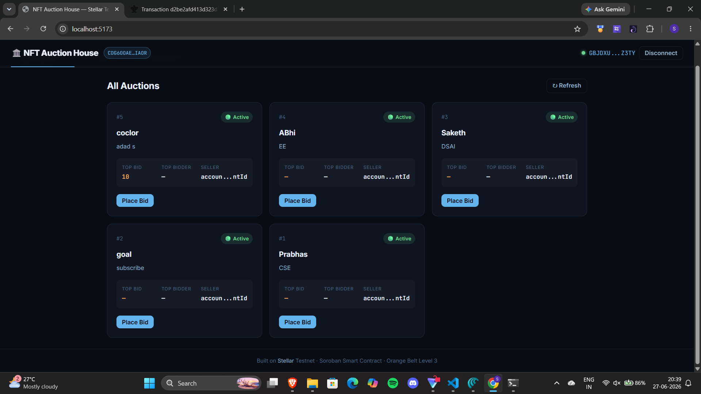

# 🏛️ NFT Auction House — Stellar Orange Belt (Level 3)

A production-ready NFT auction dApp built on Stellar Soroban testnet. Create auctions, place bids, and track live contract events in real time.

## 🌐 Live Demo
[> [Vercel URL deployment]](https://stellar-orange-belt-bvgqsvlu0-thammandra-saketh-ram.vercel.app)

## 📋 Project Overview

This project features:
- **Advanced Soroban smart contract** with event emission, bid history, and auth guards
- **Real-time event streaming** — contract events appear live in the UI without page refresh
- **Mobile-responsive React frontend** with skeleton loading, modal dialogs, and error handling
- **CI/CD pipeline** via GitHub Actions — runs contract tests + frontend build on every push
- **3 error types handled**: `wallet_not_found`, `user_rejected`, `insufficient_balance`

## 🔗 Contract Info

| Field | Value |
|-------|-------|
| Contract ID | `CB6DGSQXSOJATMILCJQ377STZKGCU2RRTFR5E34XNQABHK44YTE2M75G` |
| Network | Stellar Testnet |
| Explorer | [View on Stellar Expert](https://stellar.expert/explorer/testnet/contract/CB6DGSQXSOJATMILCJQ377STZKGCU2RRTFR5E34XNQABHK44YTE2M75G) |

## 📸 Screenshots

### Mobile Responsive UI
> Add screenshot here


### CI/CD Pipeline Running


### Test Output (6 passing tests)


## ⚙️ Setup & Run Locally

### Prerequisites
- Node.js 20+
- Rust + `wasm32-unknown-unknown` target
- Freighter browser extension (testnet mode)

### 1. Clone the repo
```bash
git clone https://github.com/YOUR_USERNAME/nft-auction-house.git
cd nft-auction-house
```

### 2. Run contract tests
```bash
cd contract
cargo test --features testutils
```

### 3. Install and run frontend
```bash
cd frontend
npm install
npm run dev
```

Open http://localhost:5173

### 4. Fund your testnet wallet
Visit https://friendbot.stellar.org?addr=YOUR_ADDRESS

## 🧪 Test Output

```
running 6 tests
test test_create_auction ... ok
test test_place_bid ... ok
test test_bid_must_be_higher ... ok
test test_end_auction ... ok
test test_cannot_bid_on_ended_auction ... ok
test test_get_multiple_auctions ... ok

test result: ok. 6 passed; 0 failed
```

## 🚀 CI/CD Pipeline

GitHub Actions runs on every push to `main`:
1. **Contract Tests** — `cargo test --features testutils`
2. **Frontend Build** — `npm ci && npm run build`
3. **Deploy** — Vercel deployment (on main branch only)

## 🗂️ Project Structure

```
nft-auction-house/
├── contract/
│   ├── src/
│   │   ├── lib.rs       # Main contract with events + bid history
│   │   └── test.rs      # 6 unit tests
│   └── Cargo.toml
├── frontend/
│   ├── src/
│   │   ├── App.jsx          # Main UI — auctions, create, live events
│   │   ├── contract.js      # Soroban RPC calls + event subscription
│   │   ├── wallets.js       # Freighter wallet integration
│   │   └── stellarConfig.js # Contract ID + network config
│   └── package.json
└── .github/
    └── workflows/
        └── ci.yml       # CI/CD pipeline
```

## 🛠️ Tech Stack

- **Smart Contract**: Rust + Soroban SDK 22
- **Frontend**: React 19 + Vite 8
- **Blockchain**: Stellar Testnet (Soroban RPC)
- **Wallet**: Freighter
- **CI/CD**: GitHub Actions
- **Hosting**: Vercel

